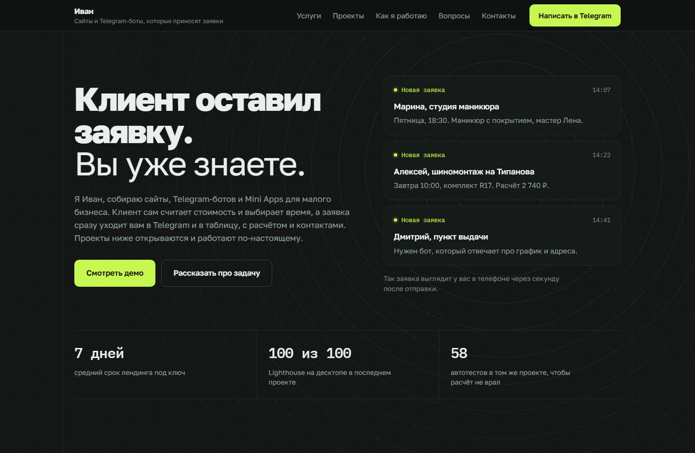

# Портфолио — сайт-хаб фриланс-разработчика

Одностраничный сайт-визитка: услуги, живые демо проектов, кейсы, вопросы и форма заявки.
Чистые HTML + CSS + JS без сборщика и фреймворков — деплоится на GitHub Pages как есть.



- **Стек:** HTML5, CSS (кастомные свойства, Grid, Flex), ванильный JS без зависимостей.
- **Внешние ресурсы:** только шрифты Golos Text и IBM Plex Mono с Google Fonts.
- **Данные проектов:** [`projects.json`](projects.json) — карточки и кейсы рендерятся из него.

## Структура

```
portfolio/
├── index.html              # вся разметка страницы
├── projects.json           # данные проектов (единственное, что правится при добавлении кейса)
├── css/
│   └── styles.css          # токены → база → примитивы → секции → адаптив
├── js/
│   ├── main.js             # приход уведомлений, появление секций, меню, аккордеон, год
│   ├── projects.js         # загрузка projects.json, фильтр со счётчиками, карточки, кейс
│   └── form.js             # валидация формы + функция sendLead(data)
├── assets/
│   ├── favicon.svg
│   ├── og.png              # картинка для превью ссылки, 1200×630
│   └── previews/
│       └── shinapro.png    # скриншот демо, 1920×1200
├── docs/
│   └── preview.png         # скриншот для этого README, на сайте не используется
├── .nojekyll               # чтобы GitHub Pages отдавал файлы как есть
└── README.md
```

## Локальный запуск

Страница читает `projects.json` через `fetch`, поэтому открывать `index.html` двойным кликом
нельзя: браузер заблокирует запрос с `file://`. Нужен любой локальный сервер.

```bash
python -m http.server 5173 --directory portfolio
```

Затем откройте <http://localhost:5173>. Альтернативы: `npx serve portfolio`,
расширение Live Server в VS Code.

## Дизайн: правила, которые держат страницу цельной

Если будете дописывать блоки, держитесь этих решений — иначе страница расползётся.

| Решение                | Как применяется                                                                 |
| ---------------------- | ------------------------------------------------------------------------------- |
| **Два шрифта**         | Golos Text — всё, что читается как речь. IBM Plex Mono — только данные: цены, сроки, время, счётчики, стек |
| **Один акцент**        | Лайм `--accent` для кнопки действия, точки уведомления, активного фильтра и фокуса. Заголовки акцентом не подкрашиваются |
| **Скругления разные**  | 0 у структурных строк (услуги, вопросы, отзывы), 10 px у кнопок и полей, 13 px у поверхностей с содержимым |
| **Заголовок с линией** | Линия тянется до правого края и подводит к цифре, которая что-то сообщает: сколько форматов, демо, ответов |
| **Нумерация**          | Только там, где есть последовательность — в разделе «Как я работаю». Услуги не нумеруются |
| **Движение**           | Один запланированный момент: уведомления приходят по очереди при загрузке. Остальное движение отвечает на действие человека |
| **Фон**                | Статичный узор на всю высоту документа: сетка точек, зерно, вертикальные направляющие по краям колонки и одна вспышка колец вокруг ленты уведомлений |

Весь фон живёт в одном блоке `.backdrop` в начале `<body>` и тянется на всю высоту документа,
поэтому узор не обрывается на границах секций. Картинок нет:

- **Сетка точек и зерно** — `.backdrop::before`, два фоновых слоя: инлайновый SVG-шум и
  `radial-gradient` с шагом 26 px. Одинаковые в любой точке страницы.
- **Кольца** — `.backdrop::after`. Радиус маски задан в пикселях через `--ring-reach`, поэтому
  вспышка гаснет плавно и ни во что не упирается. Центр задаётся `--ring-x` и `--ring-y`.
- **Направляющие** — рамка `body::after`, скрыта на экранах уже 640 px.

Яркость крутится тремя числами: прозрачность точек в `.backdrop::before`, прозрачность колец в
`.backdrop::after` и `opacity` у прямоугольника внутри SVG-шума.

> Непрозрачный фон есть только у настоящих поверхностей: карточек проектов, уведомлений, формы,
> выдвижной панели и подвала. Если добавите блоку сплошную заливку под цвет страницы, он вырежет
> в узоре прямоугольник — для разделителей используйте границы, как в полосе с цифрами.

Цвета, размеры и тайминги лежат в `:root` в начале [`css/styles.css`](css/styles.css).
Поменять акцент с лайма на оранжевый — это три переменные: `--accent`, `--accent-deep`,
`--accent-wash`.

## Деплой на GitHub Pages

### Вариант A — отдельный репозиторий (рекомендую)

1. Создайте на GitHub репозиторий, например `portfolio`.
2. Из папки `portfolio`:

```bash
git init
git add .
git commit -m "Портфолио: первая версия"
git branch -M main
git remote add origin https://github.com/KnyazIV/portfolio.git
git push -u origin main
```

3. В репозитории откройте **Settings → Pages**.
4. В блоке **Build and deployment** выберите Source: **Deploy from a branch**,
   Branch: **main**, папка: **/ (root)**. Нажмите **Save**.
5. Через 1–2 минуты сайт будет доступен по адресу `https://knyaziv.github.io/portfolio/`.

### Вариант B — главная страница профиля

Назовите репозиторий `KnyazIV.github.io` и положите содержимое папки в его корень.
Тогда адрес будет `https://knyaziv.github.io/` без суффикса.

### После деплоя

Если адрес отличается от `https://knyaziv.github.io/portfolio/`, поправьте в
[`index.html`](index.html) три места: `<link rel="canonical">`, `og:url` и `og:image`.
Они нужны для корректного превью ссылки в мессенджерах.

Кэш GitHub Pages иногда отдаёт старую версию: после пуша обновите страницу с `Ctrl+F5`.

## Как добавить новый проект

1. Положите скриншот в `assets/previews/`. Рекомендуемый размер — 1920×1200 (соотношение 16:10),
   формат PNG или WebP. Как снять скриншот: см. раздел ниже.
2. Добавьте объект в массив в [`projects.json`](projects.json). Новые проекты ставьте **в начало
   массива**: первая карточка рендерится широкой, с пометкой «Свежий проект» и списком технологий.
3. Всё. Пересобирать ничего не нужно, счётчики у фильтра и в заголовке пересчитаются сами.

### Поля объекта

| Поле       | Тип    | Обязательное | Что в нём                                                                  |
| ---------- | ------ | ------------ | -------------------------------------------------------------------------- |
| `id`       | строка | да           | Короткий слаг, уникальный. Нигде не показывается                            |
| `title`    | строка | да           | Название на карточке и в кейсе                                              |
| `tagline`  | строка | да           | Одна строка-описание под названием. 100–140 символов                        |
| `task`     | строка | да           | Кейс, «Задача»: что болело у заказчика                                      |
| `solution` | строка | да           | Кейс, «Решение»: что и почему сделано                                       |
| `result`   | строка | да           | Кейс, «Результат»: польза для владельца, цифры                              |
| `tags`     | массив | да           | Слаги для фильтра: `landing`, `bot`, `miniapp`, `integration`               |
| `tech`     | массив | да           | Технологии: чипы в кейсе и на широкой карточке                              |
| `demoUrl`  | строка | нет          | Ссылка на демо. Пустая строка — кнопка «Открыть демо» скрыта                |
| `repoUrl`  | строка | нет          | Ссылка на репозиторий. Пустая строка — кнопка «Код на GitHub» скрыта        |
| `preview`  | строка | нет          | Путь к скриншоту от корня сайта. Пустая строка — вместо картинки штриховка  |

Пример минимального объекта:

```json
{
  "id": "my-bot",
  "title": "Бот записи для барбершопа",
  "tagline": "Принимает записи в Telegram и складывает их в Google Календарь",
  "task": "Администратор вручную переносил заявки из директа в календарь и путал время.",
  "solution": "Бот на aiogram: выбор мастера и слота, запись в Google Calendar через API.",
  "result": "Записи приходят без администратора, накладки по времени исчезли.",
  "tags": ["bot", "integration"],
  "tech": ["Python", "aiogram", "Google Calendar API"],
  "demoUrl": "https://t.me/example_bot",
  "repoUrl": "https://github.com/KnyazIV/example-bot",
  "preview": "assets/previews/my-bot.png"
}
```

### Новый тип тега

Если появится категория помимо четырёх существующих:

1. Добавьте кнопку в блок `.tabs` в [`index.html`](index.html) с атрибутом `data-filter="слаг"`
   и пустым `<span class="tab__count"></span>` внутри — счётчик заполнится сам.
2. Добавьте подпись в словарь `KIND_LABELS` в начале [`js/projects.js`](js/projects.js).

### Как снять скриншот проекта

Так сделан `assets/previews/shinapro.png`: headless-браузер с эмуляцией тёмной темы.
Сохраните в файл `shot.cjs` и запустите `node shot.cjs`.

```js
const puppeteer = require("puppeteer-core");

(async () => {
  const browser = await puppeteer.launch({
    executablePath: "C:/Program Files (x86)/Microsoft/Edge/Application/msedge.exe",
    headless: "new",
    args: ["--hide-scrollbars"],
  });
  const page = await browser.newPage();
  await page.setViewport({ width: 1280, height: 800, deviceScaleFactor: 1.5 });
  await page.emulateMediaFeatures([{ name: "prefers-color-scheme", value: "dark" }]);
  await page.goto("https://ваш-проект.example", { waitUntil: "networkidle2" });
  await page.screenshot({ path: "assets/previews/имя.png" });
  await browser.close();
})();
```

Пакет ставится одной командой: `npm i -D puppeteer-core`.
Годится и обычный скриншот окна браузера, главное — соотношение сторон около 16:10
и ширина не меньше 1280 px.

## Подключение формы заявки

Сейчас форма валидируется на клиенте, а отправка заглушена: функция `sendLead(data)`
в [`js/form.js`](js/form.js) пишет заявку в консоль и возвращает успех. Всё поведение формы
(блокировка кнопки, сообщение об успехе, обработка ошибки) уже готово.

Чтобы подключить реального бота или бэкенд, поменяйте только тело `sendLead`:

```js
async function sendLead(data) {
  const response = await fetch("https://api.example.com/lead", {
    method: "POST",
    headers: { "Content-Type": "application/json" },
    body: JSON.stringify(data),
  });
  if (!response.ok) throw new Error("HTTP " + response.status);
  return response.json();
}
```

Функция получает объект `{ name, telegram, message, sentAt }`, где `sentAt` — время в ISO.
Если она бросит исключение, форма сама покажет сообщение об ошибке со ссылкой на Telegram.

> **Важно:** токен Telegram-бота нельзя класть в этот код — он виден любому посетителю.
> Нужен промежуточный эндпоинт: Cloudflare Worker, Vercel Function или ваш сервер.

## Что помечено как заглушка

В разметке расставлены комментарии `<!-- TODO: заменить -->`. Их три:

1. **Уведомления на первом экране** — имена, время и суммы вымышленные. Блок подписан как пример,
   но когда появятся реальные заявки, перепишите три карточки на настоящие, без фамилий и
   телефонов.
2. **Факт «7 дней»** в полосе с цифрами. Два других факта настоящие, они из проекта «ШинаПро».
3. **Сроки услуг** — вилки ориентировочные, уточните после первых заказов.

Цен на сайте нет намеренно: в таблице услуг стоит «по задаче». Когда прайс сложится, замените
текст в `spec__price` на числа.

Отзывов тоже нет намеренно. Вместо них раздел «Что можно проверить»: живое демо, открытый код и
измеримые результаты. Выдуманные отзывы на сайте, куда приходят реальные заказчики, — плохая идея.

## Доступность и производительность

- Семантические теги, `aria-*` на меню, фильтре, аккордеоне и панели кейса, видимый фокус.
- Панель кейса закрывается по `Esc` и клику по затемнению, удерживает `Tab` внутри себя и
  возвращает фокус на кнопку, с которой была открыта.
- Контраст самого тусклого текста к фону — 5.3:1, то есть выше нормы AA в 4.5:1.
- Скриншоты грузятся лениво (`loading="lazy"`), у всех картинок есть `alt`.
- При `prefers-reduced-motion: reduce` уведомления показываются сразу, появление секций и все
  переходы отключаются.
- Адаптив от 360 px: горизонтальной прокрутки нет ни на одной ширине.
